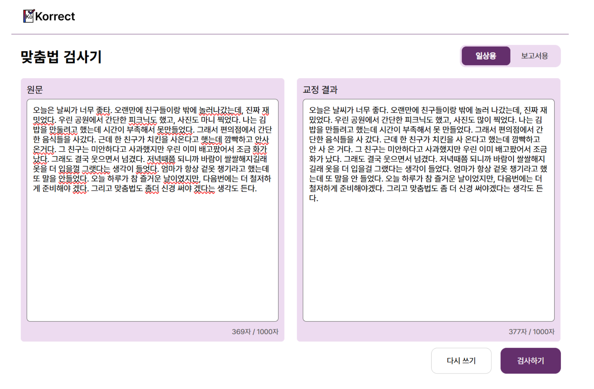
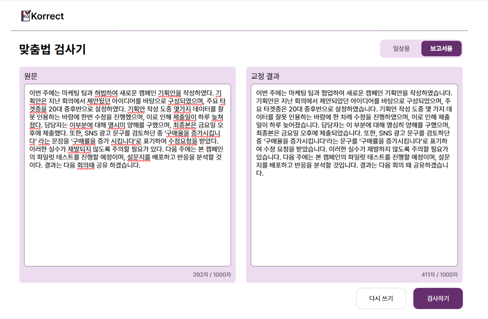

# Korrect

Korrect is a team project for Korean spelling and style correction. The service combines a React web UI with a FastAPI backend, then uses Gemini 2.0 Flash, retrieval-augmented prompts, and rule references to revise user input while preserving meaning and tone.

This repository is suitable for portfolio-style documentation because it contains both the shipped web code and the project materials used to explain the system design and evaluation results.

- Original repository: `<https://github.com/dakval/korrect>`

## What It Does

- Corrects Korean spelling and spacing errors from free-form user input
- Supports two modes: `casual` for everyday writing and `formal` for report-style wording
- Accepts up to 1000 characters per request in the UI
- Shows corrected output in a simple web interface with loading feedback

## Stack

- Frontend: React, CSS, Fetch API
- Backend: FastAPI, Uvicorn, Pydantic, CORS middleware
- LLM pipeline: Gemini 2.0 Flash
- Retrieval: `sentence-transformers`, `torch`, `numpy`
- Embedding model: `jhgan/ko-sroberta-multitask`
- Deployment target in project docs: Render

## How The System Works

1. The React frontend collects the input text and selected mode.
2. It sends a POST request to `/api/correct`.
3. The backend splits the text into sentences.
4. Each sentence is embedded and matched against the stored RAG reference chunks.
5. Retrieved references are inserted into the Gemini prompt.
6. The model returns corrected text, which is then rendered in the result panel.

## Project Highlights

- Scenario-aware correction flow instead of a single generic spell checker
- RAG-assisted prompting to improve consistency on Korean writing rules
- Rule-reference based design intended to reduce unwanted rewriting
- End-to-end delivery across UI, API, model integration, and deployment

## Evaluation Snapshot

Based on the final report included in this repository, the project compared its RAG-enhanced Gemini pipeline with `py-hanspell` as a baseline.

| Metric            | Korrect | py-hanspell |
| ----------------- | ------: | ----------: |
| WER               |   0.080 |       0.195 |
| CER               |   0.020 |       0.049 |
| Precision         |   0.940 |       0.847 |
| Recall            |   0.933 |       0.847 |
| Cosine Similarity |   0.986 |       0.956 |
| BLEU-4            |   0.874 |       0.757 |

According to the project materials, the system reduced error rate and improved semantic retention and fluency compared with the baseline.

## Repository Notes

- Frontend entry: [src/pages/home.js](./src/pages/home.js)
- Backend entry: [backend/main.py](./backend/main.py)

## Screenshots

